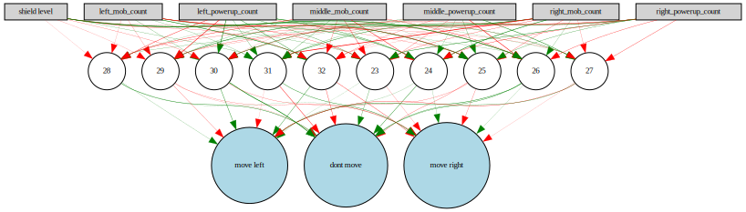

## NEAT for SpaceShooter game

Link to the original <a href="https://github.com/tasdikrahman/spaceShooter">game</a>.  
Link to the neat <a href="https://neat-python.readthedocs.io/en/latest/index.html">docs</a>.
## Project structure

```plaintext
├── create_recording.py         # script for create gif with gameplay 
├── Digraph.gv 
├── Digraph.gv.svg              # svg with the best neural network
├── gameplay.gif                # gif with gameplay
├── README.md
├── spaceshooter
│   ├── assets                  # folder with assets for the game
│   ├── constants.py            # file with constants
│   ├── __init__.py
│   ├── Mob.py                  # class Mob
│   ├── Player.py               # class Player
│   ├── SpaceShooterGame.py     # class SpaceShooterGame
│   ├── spaceShooter.py         # old file with the game
│   └── Utils.py                # class Pow + class Explosion
├── spaceshooter_config.config  # config file for neat 
├── train.py                    # file for training 
├── visualize.py                # file with visualization functions
└── winner-feedforward          # dump with winner model
└── requirements.txt
```

## How to start

1) Clone repository

2) Create virtual environment and install packages

``` bash
pyton -m venv {venv_name} 
source {venv_name}/bin/activate 
pip install -r requirements.txt
```
3) Run train.py to start  
```bash
python train.py
```

After the code completed some files will be created:  
- winner-feedforwand  
- Digraph.gv.svg

(Optional)  
Run `create_recording.py` to make a gif with gameplay. After that gameplay.gif will be created
To adjust some neat params change them in `spaceshooter_config.config`

## My results
The game is simple and not balanced, so the best solution is to choose one border and stay there. This solution is boring, so I tried to somehow force the neural network to stay in the middle by manipulating the fitness function and adding randomness to the decision process.
Even though it is not working well, the acquired gif is cherry-picking because sometimes the game ends at the start.

The neural network receives a vector with the game state and makes a decision to move left, right, or stay straight.

Received the winner NN structure:
<div align='center'>
    
</div>

A part of the gaming process:

<div align='center'>
    
</div>
